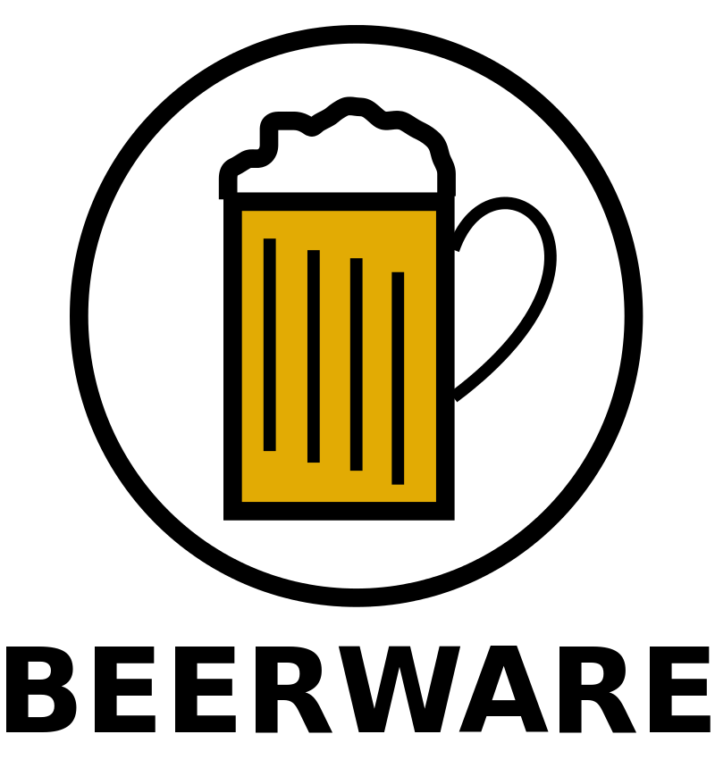

# Readme -  🇬🇧 version

French version : [🇫🇷](../../Readme.md)

## Table of Contents

- [Introduction](#introduction)
- [Technologies Used](#technologies-used)
- [Contributing](#contributing)
- [License](#license) 

## Introduction

This project template provides a standardized project structure for developers working with Symfony. It uses Docker to manage the development environment, ensuring that the application runs smoothly in all development environments.

## Technologies Used

- Symfony and PHP8 for back-end development.
- Stimulus, Twig, and Bootstrap for front-end development.
- Nginx as the web server for the application.
- PostgreSQL as the database.
- Docker to manage the development environment.

## Contributing

We welcome contributions to improve this project template. If you have any feedback, suggestions, or issues to report, please feel free to create an issue in the repository or submit a pull request.

## License

This project template is licensed under the Beerware License. Please see the LICENSE file for more information: [LICENSE](LICENSE.md)
